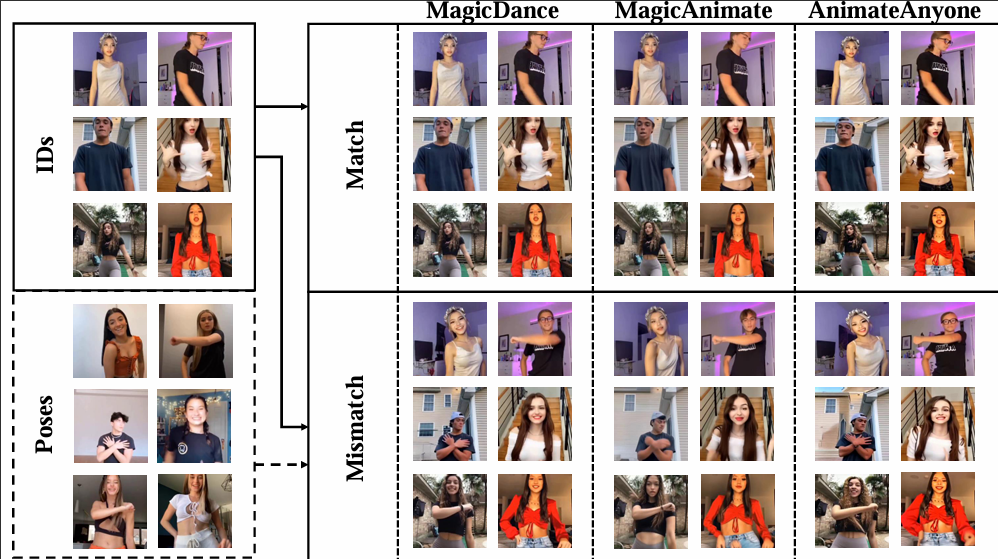

# (TikTok-DeepFake) TT-DF
Official repository for TikTok-DeepFake (TT-DF). TikTok-DeepFake (TT-DF) is a pioneering large-scale diffusion-based dataset containing 6,120 forged videos with 1,378,857 synthetic frames, specifically tailored for human body forgery detection. 

TT-DF: A Large-Scale Diffusion-Based Dataset and Benchmark for Human Body Forgery Detection

[Wenkui Yang]((https://scholar.google.com/citations?hl=en&user=neqd5X0AAAAJ),
Zhida Zhang, 
[Xiaoqiang Zhou](https://scholar.google.com/citations?hl=en&user=Z2BTkNIAAAAJ),
[Junxian Duan](https://scholar.google.com/citations?hl=en&user=Ar_k4v0AAAAJ), 
[Jie Cao](https://scholar.google.com/citations?hl=en&user=lPLM5oMAAAAJ)

## Updates
Thank you for your incredible support and interest in our project. We are here to assure you that we are actively working on preparing our TT-DF dataset for public release. Although we cannot commit to a specific release date at this very moment, please be certain that the intention to provide access to the dataset is firm (no later than October 20, 2024, after PRCV24 conf). 

Thank you for your understanding and continuous support.  
