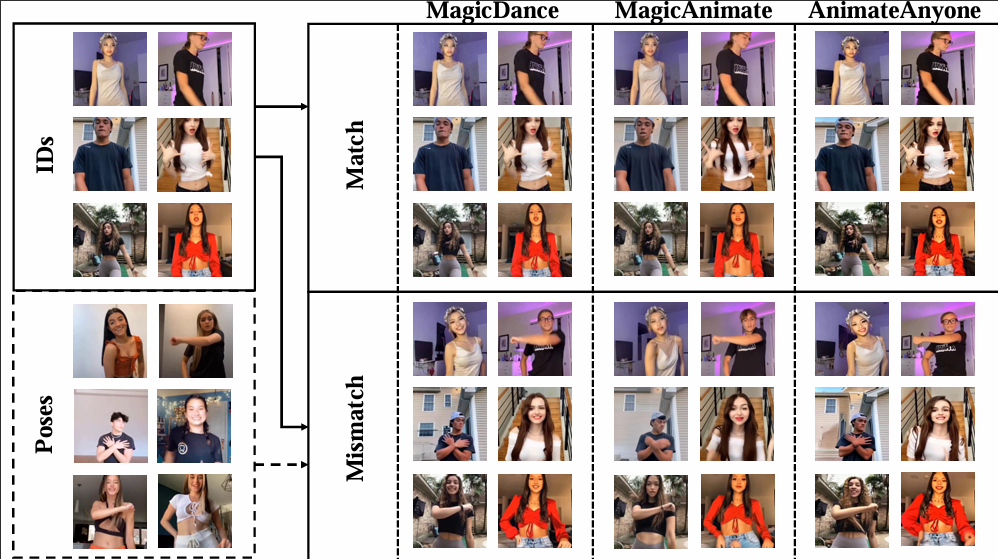

# (TikTok-DeepFake) TT-DF
Official repository for TikTok-DeepFake (TT-DF). TikTok-DeepFake (TT-DF) is a pioneering large-scale diffusion-based dataset containing 6,120 forged videos with 1,378,857 synthetic frames, specifically tailored for human body forgery detection. 

[TT-DF: A Large-Scale Diffusion-Based Dataset and Benchmark for Human Body Forgery Detection (PRCV'24)](https://link.springer.com/chapter/10.1007/978-981-97-8795-1_29)

[Wenkui Yang](https://scholar.google.com/citations?hl=en&user=neqd5X0AAAAJ),
Zhida Zhang, 
[Xiaoqiang Zhou](https://scholar.google.com/citations?hl=en&user=Z2BTkNIAAAAJ),
[Junxian Duan](https://scholar.google.com/citations?hl=en&user=Ar_k4v0AAAAJ), 
[Jie Cao](https://scholar.google.com/citations?hl=en&user=lPLM5oMAAAAJ)




# Updates
Thank you for your incredible support and interest in our project! TT-DF dataset is now available via [Google Drive](https://drive.google.com/drive/folders/1O1ZwHpSgTLZDjMFpmX7_IfNGTuVU_9s6?usp=sharing)!

# Contact
If you find any problems, please contact us via - [wenkui.yang@cripac.ia.ac.cn](wenkui.yang@cripac.ia.ac.cn)

# Citation

```
@inproceedings{yang2024tt,
  title={TT-DF: A Large-Scale Diffusion-Based Dataset and Benchmark for Human Body Forgery Detection},
  author={Yang, Wenkui and Zhang, Zhida and Zhou, Xiaoqiang and Duan, Junxian and Cao, Jie},
  booktitle={Chinese Conference on Pattern Recognition and Computer Vision (PRCV)},
  pages={429--443},
  year={2024},
  organization={Springer}
}
```
